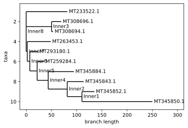

# Week 2: Looking at Some Data

---

## Overview

Some guidance on what to take a look at:

* Consider what questions we want to ask from our evolutionary tree analysis. Think about what questions the book was trying to answer. Do we even have the data in this notebook to answer some of those questions? If not, spend time trying to find it now that you can know more about what to look for in terms of format. Do some literature searching and see what other work has been done for this virus and others.
* Research and try different evolutionary tree programs/frameworks. What I've done below is not the only game in town by far. Biopython itself has different options.
* Consider the alignment itself. Are there different ways to do this? Did we do it correctly?
* What about the sequences themselves? Are they all of the same quality? Should we exclude some?
* What about the virus alignment program? Did we use that correctly? Should we have done the entire sequence instead of using Spike as a reference? Should we try a different reference.
* Do we have more data available about the sequences? Part of world, etc. Can we do some digging here to answer different questions.
* And I'm sure you can think of more to attempt... Think about what you want to do. Spend time working towards a well thoughtout goal. Document things as you go. Talk to everyone on Slack. Together we can do this!

---

## Getting some Initial Data


```python
import wget

url = 'https://covid19.galaxyproject.org/genomics/4-Variation/current_complete_ncov_genomes.fasta'
file = 'data/current_complete_ncov_genomes.fasta'
#wget.download(url, file)
```

Getting an alignment (sequence MT350234.1 had an error):


```python
#!virulign ../../virulign/references/SARS-CoV-2/S.xml data/current_complete_ncov_genomes.fasta --exportAlphabet Nucleotides --exportKind PositionTable > data/position_table.csv
```

---

## Some Initial Work

### Read the Data into a pandas DataFrame


```python
import pandas as pd
position_table = pd.read_csv('data/position_table.csv')
results = position_table.describe()
display(position_table)
display(results)
```


<div>
<style scoped>
    .dataframe tbody tr th:only-of-type {
        vertical-align: middle;
    }

    .dataframe tbody tr th {
        vertical-align: top;
    }

    .dataframe thead th {
        text-align: right;
    }
</style>
<table border="1" class="dataframe">
  <thead>
    <tr style="text-align: right;">
      <th></th>
      <th>seqid</th>
      <th>S_1_1</th>
      <th>S_1_2</th>
      <th>S_1_3</th>
      <th>S_2_1</th>
      <th>S_2_2</th>
      <th>S_2_3</th>
      <th>S_3_1</th>
      <th>S_3_2</th>
      <th>S_3_3</th>
      <th>...</th>
      <th>S_1270_3</th>
      <th>S_1271_1</th>
      <th>S_1271_2</th>
      <th>S_1271_3</th>
      <th>S_1272_1</th>
      <th>S_1272_2</th>
      <th>S_1272_3</th>
      <th>S_1273_1</th>
      <th>S_1273_2</th>
      <th>S_1273_3</th>
    </tr>
  </thead>
  <tbody>
    <tr>
      <th>0</th>
      <td>MT007544.1</td>
      <td>A</td>
      <td>T</td>
      <td>G</td>
      <td>T</td>
      <td>T</td>
      <td>T</td>
      <td>G</td>
      <td>T</td>
      <td>T</td>
      <td>...</td>
      <td>A</td>
      <td>C</td>
      <td>A</td>
      <td>T</td>
      <td>T</td>
      <td>A</td>
      <td>C</td>
      <td>A</td>
      <td>C</td>
      <td>A</td>
    </tr>
    <tr>
      <th>1</th>
      <td>MT019529.1</td>
      <td>A</td>
      <td>T</td>
      <td>G</td>
      <td>T</td>
      <td>T</td>
      <td>T</td>
      <td>G</td>
      <td>T</td>
      <td>T</td>
      <td>...</td>
      <td>A</td>
      <td>C</td>
      <td>A</td>
      <td>T</td>
      <td>T</td>
      <td>A</td>
      <td>C</td>
      <td>A</td>
      <td>C</td>
      <td>A</td>
    </tr>
    <tr>
      <th>2</th>
      <td>MT019530.1</td>
      <td>A</td>
      <td>T</td>
      <td>G</td>
      <td>T</td>
      <td>T</td>
      <td>T</td>
      <td>G</td>
      <td>T</td>
      <td>T</td>
      <td>...</td>
      <td>A</td>
      <td>C</td>
      <td>A</td>
      <td>T</td>
      <td>T</td>
      <td>A</td>
      <td>C</td>
      <td>A</td>
      <td>C</td>
      <td>A</td>
    </tr>
    <tr>
      <th>3</th>
      <td>MT019531.1</td>
      <td>A</td>
      <td>T</td>
      <td>G</td>
      <td>T</td>
      <td>T</td>
      <td>T</td>
      <td>G</td>
      <td>T</td>
      <td>T</td>
      <td>...</td>
      <td>A</td>
      <td>C</td>
      <td>A</td>
      <td>T</td>
      <td>T</td>
      <td>A</td>
      <td>C</td>
      <td>A</td>
      <td>C</td>
      <td>A</td>
    </tr>
    <tr>
      <th>4</th>
      <td>MT019532.1</td>
      <td>A</td>
      <td>T</td>
      <td>G</td>
      <td>T</td>
      <td>T</td>
      <td>T</td>
      <td>G</td>
      <td>T</td>
      <td>T</td>
      <td>...</td>
      <td>A</td>
      <td>C</td>
      <td>A</td>
      <td>T</td>
      <td>T</td>
      <td>A</td>
      <td>C</td>
      <td>A</td>
      <td>C</td>
      <td>A</td>
    </tr>
    <tr>
      <th>...</th>
      <td>...</td>
      <td>...</td>
      <td>...</td>
      <td>...</td>
      <td>...</td>
      <td>...</td>
      <td>...</td>
      <td>...</td>
      <td>...</td>
      <td>...</td>
      <td>...</td>
      <td>...</td>
      <td>...</td>
      <td>...</td>
      <td>...</td>
      <td>...</td>
      <td>...</td>
      <td>...</td>
      <td>...</td>
      <td>...</td>
      <td>...</td>
    </tr>
    <tr>
      <th>815</th>
      <td>MT350277.1</td>
      <td>A</td>
      <td>T</td>
      <td>G</td>
      <td>T</td>
      <td>T</td>
      <td>T</td>
      <td>G</td>
      <td>T</td>
      <td>T</td>
      <td>...</td>
      <td>A</td>
      <td>C</td>
      <td>A</td>
      <td>T</td>
      <td>T</td>
      <td>A</td>
      <td>C</td>
      <td>A</td>
      <td>C</td>
      <td>A</td>
    </tr>
    <tr>
      <th>816</th>
      <td>MT350278.1</td>
      <td>A</td>
      <td>T</td>
      <td>G</td>
      <td>T</td>
      <td>T</td>
      <td>T</td>
      <td>G</td>
      <td>T</td>
      <td>T</td>
      <td>...</td>
      <td>A</td>
      <td>C</td>
      <td>A</td>
      <td>T</td>
      <td>T</td>
      <td>A</td>
      <td>C</td>
      <td>A</td>
      <td>C</td>
      <td>A</td>
    </tr>
    <tr>
      <th>817</th>
      <td>MT350279.1</td>
      <td>A</td>
      <td>T</td>
      <td>G</td>
      <td>T</td>
      <td>T</td>
      <td>T</td>
      <td>G</td>
      <td>T</td>
      <td>T</td>
      <td>...</td>
      <td>A</td>
      <td>C</td>
      <td>A</td>
      <td>T</td>
      <td>T</td>
      <td>A</td>
      <td>C</td>
      <td>A</td>
      <td>C</td>
      <td>A</td>
    </tr>
    <tr>
      <th>818</th>
      <td>MT350280.1</td>
      <td>A</td>
      <td>T</td>
      <td>G</td>
      <td>T</td>
      <td>T</td>
      <td>T</td>
      <td>G</td>
      <td>T</td>
      <td>T</td>
      <td>...</td>
      <td>A</td>
      <td>C</td>
      <td>A</td>
      <td>T</td>
      <td>T</td>
      <td>A</td>
      <td>C</td>
      <td>A</td>
      <td>C</td>
      <td>A</td>
    </tr>
    <tr>
      <th>819</th>
      <td>MT350282.1</td>
      <td>A</td>
      <td>T</td>
      <td>G</td>
      <td>T</td>
      <td>T</td>
      <td>T</td>
      <td>G</td>
      <td>T</td>
      <td>T</td>
      <td>...</td>
      <td>A</td>
      <td>C</td>
      <td>A</td>
      <td>T</td>
      <td>T</td>
      <td>A</td>
      <td>C</td>
      <td>A</td>
      <td>C</td>
      <td>A</td>
    </tr>
  </tbody>
</table>
<p>820 rows × 3820 columns</p>
</div>


<div>
<style scoped>
    .dataframe tbody tr th:only-of-type {
        vertical-align: middle;
    }

    .dataframe tbody tr th {
        vertical-align: top;
    }

    .dataframe thead th {
        text-align: right;
    }
</style>
<table border="1" class="dataframe">
  <thead>
    <tr style="text-align: right;">
      <th></th>
      <th>seqid</th>
      <th>S_1_1</th>
      <th>S_1_2</th>
      <th>S_1_3</th>
      <th>S_2_1</th>
      <th>S_2_2</th>
      <th>S_2_3</th>
      <th>S_3_1</th>
      <th>S_3_2</th>
      <th>S_3_3</th>
      <th>...</th>
      <th>S_1270_3</th>
      <th>S_1271_1</th>
      <th>S_1271_2</th>
      <th>S_1271_3</th>
      <th>S_1272_1</th>
      <th>S_1272_2</th>
      <th>S_1272_3</th>
      <th>S_1273_1</th>
      <th>S_1273_2</th>
      <th>S_1273_3</th>
    </tr>
  </thead>
  <tbody>
    <tr>
      <th>count</th>
      <td>820</td>
      <td>820</td>
      <td>820</td>
      <td>820</td>
      <td>820</td>
      <td>820</td>
      <td>820</td>
      <td>820</td>
      <td>820</td>
      <td>820</td>
      <td>...</td>
      <td>820</td>
      <td>820</td>
      <td>820</td>
      <td>820</td>
      <td>820</td>
      <td>820</td>
      <td>820</td>
      <td>820</td>
      <td>820</td>
      <td>820</td>
    </tr>
    <tr>
      <th>unique</th>
      <td>820</td>
      <td>1</td>
      <td>1</td>
      <td>1</td>
      <td>1</td>
      <td>1</td>
      <td>1</td>
      <td>1</td>
      <td>1</td>
      <td>1</td>
      <td>...</td>
      <td>1</td>
      <td>1</td>
      <td>1</td>
      <td>1</td>
      <td>1</td>
      <td>1</td>
      <td>1</td>
      <td>1</td>
      <td>1</td>
      <td>1</td>
    </tr>
    <tr>
      <th>top</th>
      <td>MT293188.1</td>
      <td>A</td>
      <td>T</td>
      <td>G</td>
      <td>T</td>
      <td>T</td>
      <td>T</td>
      <td>G</td>
      <td>T</td>
      <td>T</td>
      <td>...</td>
      <td>A</td>
      <td>C</td>
      <td>A</td>
      <td>T</td>
      <td>T</td>
      <td>A</td>
      <td>C</td>
      <td>A</td>
      <td>C</td>
      <td>A</td>
    </tr>
    <tr>
      <th>freq</th>
      <td>1</td>
      <td>820</td>
      <td>820</td>
      <td>820</td>
      <td>820</td>
      <td>820</td>
      <td>820</td>
      <td>820</td>
      <td>820</td>
      <td>820</td>
      <td>...</td>
      <td>820</td>
      <td>820</td>
      <td>820</td>
      <td>820</td>
      <td>820</td>
      <td>820</td>
      <td>820</td>
      <td>820</td>
      <td>820</td>
      <td>820</td>
    </tr>
  </tbody>
</table>
<p>4 rows × 3820 columns</p>
</div>


### Pull Out the Consensus Sequence

Consensus Sequence
: a sequence of DNA having similar structure and function in different organisms.


```python
consensus_seq = position_table.drop('seqid',axis=1).mode(axis=0).T[0]
display(consensus_seq)
position_table.set_index('seqid',inplace=True)
```


    S_1_1       A
    S_1_2       T
    S_1_3       G
    S_2_1       T
    S_2_2       T
               ..
    S_1272_2    A
    S_1272_3    C
    S_1273_1    A
    S_1273_2    C
    S_1273_3    A
    Name: 0, Length: 3819, dtype: object


---

## Utilizing Biopython for Initial Analysis

Determine which samples are farthest from the concensus sequence


```python
distance_from_consensus_seq = position_table.apply(lambda row: sum(row != consensus_seq),axis=1)
distance_from_consensus_seq_sorted = distance_from_consensus_seq.sort_values(ascending=False)
display(distance_from_consensus_seq_sorted)
```


    seqid
    MT345850.1    263
    MT345852.1    141
    MT345843.1    122
    MT345884.1     97
    MT233522.1     82
                 ... 
    MT263449.1      0
    MT263451.1      0
    MT263452.1      0
    MT263454.1      0
    MT263422.1      0
    Length: 820, dtype: int64


Select 10 sequences to do our first analysis


```python
subset_seqs = distance_from_consensus_seq_sorted[:10].index
display(subset_seqs)
```


    Index(['MT345850.1', 'MT345852.1', 'MT345843.1', 'MT345884.1', 'MT233522.1',
           'MT308696.1', 'MT308694.1', 'MT263453.1', 'MT259284.1', 'MT293180.1'],
          dtype='object', name='seqid')


Construct a distance matrix for the sequences


```python
distances = {}
for i,seqid1 in enumerate(subset_seqs):
    distances[seqid1,seqid1] = 0
    for j in range(i+1,len(subset_seqs)):
        seqid2 = subset_seqs[j]
        distances[seqid1,seqid2] = sum(position_table.loc[seqid1] != position_table.loc[seqid2])
        distances[seqid2,seqid1] = distances[seqid1,seqid2]
distances = pd.Series(distances).unstack()
display(distances)
```


<div>
<style scoped>
    .dataframe tbody tr th:only-of-type {
        vertical-align: middle;
    }

    .dataframe tbody tr th {
        vertical-align: top;
    }

    .dataframe thead th {
        text-align: right;
    }
</style>
<table border="1" class="dataframe">
  <thead>
    <tr style="text-align: right;">
      <th></th>
      <th>MT233522.1</th>
      <th>MT259284.1</th>
      <th>MT263453.1</th>
      <th>MT293180.1</th>
      <th>MT308694.1</th>
      <th>MT308696.1</th>
      <th>MT345843.1</th>
      <th>MT345850.1</th>
      <th>MT345852.1</th>
      <th>MT345884.1</th>
    </tr>
  </thead>
  <tbody>
    <tr>
      <th>MT233522.1</th>
      <td>0</td>
      <td>115</td>
      <td>130</td>
      <td>104</td>
      <td>135</td>
      <td>151</td>
      <td>202</td>
      <td>345</td>
      <td>221</td>
      <td>177</td>
    </tr>
    <tr>
      <th>MT259284.1</th>
      <td>115</td>
      <td>0</td>
      <td>81</td>
      <td>47</td>
      <td>86</td>
      <td>104</td>
      <td>107</td>
      <td>230</td>
      <td>108</td>
      <td>94</td>
    </tr>
    <tr>
      <th>MT263453.1</th>
      <td>130</td>
      <td>81</td>
      <td>0</td>
      <td>68</td>
      <td>101</td>
      <td>119</td>
      <td>134</td>
      <td>299</td>
      <td>189</td>
      <td>143</td>
    </tr>
    <tr>
      <th>MT293180.1</th>
      <td>104</td>
      <td>47</td>
      <td>68</td>
      <td>0</td>
      <td>77</td>
      <td>93</td>
      <td>130</td>
      <td>273</td>
      <td>153</td>
      <td>89</td>
    </tr>
    <tr>
      <th>MT308694.1</th>
      <td>135</td>
      <td>86</td>
      <td>101</td>
      <td>77</td>
      <td>0</td>
      <td>22</td>
      <td>175</td>
      <td>286</td>
      <td>194</td>
      <td>150</td>
    </tr>
    <tr>
      <th>MT308696.1</th>
      <td>151</td>
      <td>104</td>
      <td>119</td>
      <td>93</td>
      <td>22</td>
      <td>0</td>
      <td>191</td>
      <td>288</td>
      <td>210</td>
      <td>166</td>
    </tr>
    <tr>
      <th>MT345843.1</th>
      <td>202</td>
      <td>107</td>
      <td>134</td>
      <td>130</td>
      <td>175</td>
      <td>191</td>
      <td>0</td>
      <td>211</td>
      <td>77</td>
      <td>115</td>
    </tr>
    <tr>
      <th>MT345850.1</th>
      <td>345</td>
      <td>230</td>
      <td>299</td>
      <td>273</td>
      <td>286</td>
      <td>288</td>
      <td>211</td>
      <td>0</td>
      <td>164</td>
      <td>276</td>
    </tr>
    <tr>
      <th>MT345852.1</th>
      <td>221</td>
      <td>108</td>
      <td>189</td>
      <td>153</td>
      <td>194</td>
      <td>210</td>
      <td>77</td>
      <td>164</td>
      <td>0</td>
      <td>136</td>
    </tr>
    <tr>
      <th>MT345884.1</th>
      <td>177</td>
      <td>94</td>
      <td>143</td>
      <td>89</td>
      <td>150</td>
      <td>166</td>
      <td>115</td>
      <td>276</td>
      <td>136</td>
      <td>0</td>
    </tr>
  </tbody>
</table>
</div>


Constructing the Distance Matrix


```python
from Bio.Phylo.TreeConstruction import DistanceMatrix
import numpy as np
matrix = np.tril(distances.values).tolist()
for i in range(len(matrix)):
    matrix[i] = matrix[i][:i+1]
dm = DistanceMatrix(list(distances.index),matrix)
```

Now construct the tree


```python
from Bio.Phylo.TreeConstruction import DistanceTreeConstructor
constructor = DistanceTreeConstructor()
tree = constructor.nj(dm)
```

Drawing the tree


```python
%matplotlib inline

from Bio import Phylo
tree.ladderize() # Flip branches so deeper clades are displayed at top
Phylo.draw(tree)
```





---

## Trying Other DNA Alignment Tools

With knowledge that Biopython has built-in shortcuts to run some popular alignment tools, I thought it would be interesting to see how it differed from Virulign.

ClustalW, one of the DNA alignment tools that Biopython can use, takes way too long to run. It ran overnight and still didn't finish, so it's not a very viable option without a better understanding of parameters.


```python
from Bio.Align.Applications import ClustalwCommandline

cmd = ClustalwCommandline('clustalw2',infile=cov_seq_file)
print(cmd)
#cmd()
```

    clustalw2 -infile=./data/current_complete_ncov_genomes.fasta
    

MUSCLE is another one, but it runs out of memory when trying to run it on my PC.


```python
from Bio.Align.Applications import MuscleCommandline

cmd = MuscleCommandline(input=cov_seq_file,out='.'+cov_seq_file.split('.')[1]+'_aligned.fasta')
print(cmd)
#cmd()
```

    muscle -in ./data/current_complete_ncov_genomes.fasta -out ./data/current_complete_ncov_genomes_aligned.fasta
    

After searching the internet, it was hard to find any tool that could align the entire file (~24MB in size) online, which was pretty much the only other popular options available for Windows.


```python

```
