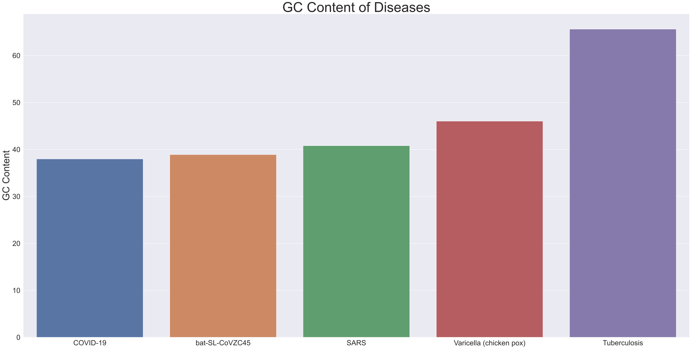

# Week 3

---

# How similar is COVID-19 to Other Coronaviruses?

Consider the following coronavirus genomes:

1. SARS coronavirus

2. Bat SARS-like coronavirus isolate

3. COVID-19

This notebook will continue comparing these 3 coronavirus strands as a follow up to the Trimer Composition.


```python
import itertools
import matplotlib.pyplot as plt
import numpy as np
import pandas as pd
import seaborn as sns
from Bio import SeqIO,AlignIO,Seq

sns.set_style("darkgrid")
sns.set(rc={'figure.figsize':(40,20),'axes.titlesize':46, 'axes.labelsize':32, 'xtick.labelsize': 24, 'ytick.labelsize': 24})
```

---

## Comparing GC content

GC content (guanine-cytosine content) is the proportion of nucleotides:
$$
\mbox{GC content} = (G_{count} + C_{count}) / (\mbox{Total Nucleotides}) * 100
$$


```python
def get_gc_comp(seq):
    total_nucleotides = len(seq)
    G_count,C_count = seq.count('G'),seq.count('C')
    return (G_count + C_count) / total_nucleotides * 100
```

### SARS

Using a single complete genome (ZJ0301)


```python
sars_seq_file = './data/SARSsequence.fasta'

sars_seq = list(SeqIO.parse(sars_seq_file,"fasta"))[0]
print(sars_seq)
```

    ID: DQ182595
    Name: DQ182595
    Description: DQ182595 |SARS coronavirus ZJ0301 from China| complete genome
    Number of features: 0
    Seq('TACCCAGGAAAAGCCAACCAACCTCGATCTCTTGTAGATCTGTTCTCTAAACGA...AGA', SingleLetterAlphabet())
    


```python
sars_gc = get_gc_comp(sars_seq.seq)
print(sars_gc)
```

    40.80320473978321
    

### Bat SARS-like Coronavirus Isolate (bat-SL-CoVZC45)

Using a single complete genome


```python
bat_seq_file = './data/bat-SL-CoVZC45sequence.fasta'

bat_seq = list(SeqIO.parse(bat_seq_file,"fasta"))[0]
print(bat_seq)
```

    ID: MG772933.1
    Name: MG772933.1
    Description: MG772933.1 Bat SARS-like coronavirus isolate bat-SL-CoVZC45, complete genome
    Number of features: 0
    Seq('ATATTAGGTTTTTACCTTCCCAGGTAACAAACCAACTAACTCTCGATCTCTTGT...AAA', SingleLetterAlphabet())
    


```python
bat_gc = get_gc_comp(bat_seq.seq)
print(bat_gc)
```

    38.90342930004698
    

### COVID-19

Using complete genome of reference sequence NC_045512


```python
cov_seq_file = './data/COVID19refsequence.fasta'

cov_seq = list(SeqIO.parse(cov_seq_file,"fasta"))[0]
print(cov_seq)
```

    ID: NC_045512.2
    Name: NC_045512.2
    Description: NC_045512.2 Severe acute respiratory syndrome coronavirus 2 isolate Wuhan-Hu-1, complete genome
    Number of features: 0
    Seq('ATTAAAGGTTTATACCTTCCCAGGTAACAAACCAACCAACTTTCGATCTCTTGT...AAA', SingleLetterAlphabet())
    


```python
cov_gc = get_gc_comp(cov_seq.seq)
print(cov_gc)
```

    37.97277865097147
    

---

It looks like COVID-19 is very similar to the bat coronavirus (less than 1% difference), but comparing all 3 to other diseases might help solidify the similarities in GC content.

###


```python
# TB
tb_seq_file = './data/TBsequence.fasta'

tb_seq = list(SeqIO.parse(tb_seq_file,"fasta"))[0]
print(tb_seq)
tb_gc = get_gc_comp(tb_seq.seq)
print(tb_gc,'\n')

# Chicken pox virus
hhv_seq_file = './data/HHV3sequence.fasta'

hhv_seq = list(SeqIO.parse(hhv_seq_file,"fasta"))[0]
print(hhv_seq)
hhv_gc = get_gc_comp(hhv_seq.seq)
print(hhv_gc)
```

    ID: AL123456.3
    Name: AL123456.3
    Description: AL123456.3 Mycobacterium tuberculosis H37Rv complete genome
    Number of features: 0
    Seq('TTGACCGATGACCCCGGTTCAGGCTTCACCACAGTGTGGAACGCGGTCGTCTCC...TCG', SingleLetterAlphabet())
    65.61466628826449 
    
    ID: NC_001348.1
    Name: NC_001348.1
    Description: NC_001348.1 Human herpesvirus 3, complete genome
    Number of features: 0
    Seq('AGGCCAGCCCTCTCGCGGCCCCCTCGAGAGAGAAAAAAAAAAGCGACCCCACCT...AGG', SingleLetterAlphabet())
    46.02030684475193
    

Now time to look at the GC content side by side via Bar Graph


```python
df = pd.DataFrame([cov_gc,bat_gc,sars_gc,hhv_gc,tb_gc],index=['COVID-19','bat-SL-CoVZC45','SARS','Varicella (chicken pox)','Tuberculosis']).T
df
```


<div>
<style scoped>
    .dataframe tbody tr th:only-of-type {
        vertical-align: middle;
    }

    .dataframe tbody tr th {
        vertical-align: top;
    }

    .dataframe thead th {
        text-align: right;
    }
</style>
<table border="1" class="dataframe">
  <thead>
    <tr style="text-align: right;">
      <th></th>
      <th>COVID-19</th>
      <th>bat-SL-CoVZC45</th>
      <th>SARS</th>
      <th>Varicella (chicken pox)</th>
      <th>Tuberculosis</th>
    </tr>
  </thead>
  <tbody>
    <tr>
      <th>0</th>
      <td>37.972779</td>
      <td>38.903429</td>
      <td>40.803205</td>
      <td>46.020307</td>
      <td>65.614666</td>
    </tr>
  </tbody>
</table>
</div>


```python
bar_plt = sns.barplot(data=df)
bar_plt.set(ylabel='GC Content',title='GC Content of Diseases');
```





The progression of similarity between the different diseases is apparent. The viruses are all much closer in similarity than the bacterial disease, the coronavirus strands are even more similar than the other virus, and COVID-19/bat-SL-CoVZC45 are even closer related in terms of GC content.

This shows more evidence about the findings that COVID-19 could have evolved from this bat coronavirus.

---

##
